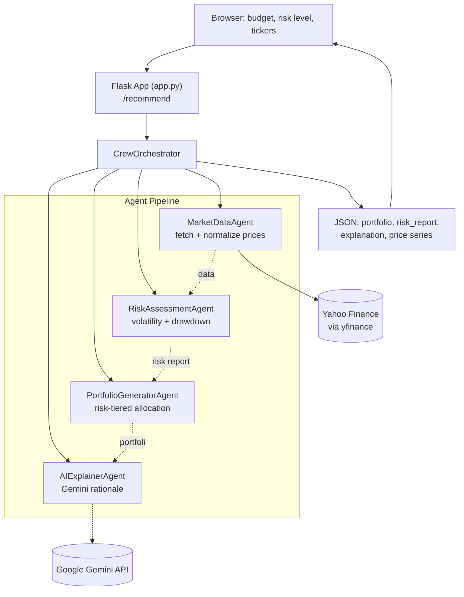

# Agentic Investment Advisor

> A multi-agent portfolio recommendation system that pulls live market data, quantifies risk, allocates a budget across assets, and explains the reasoning in plain language — via a Flask API with a CrewAI-style agent pipeline and Gemini-powered explanations.

[](#)
[](#)
[](#)
[](#)
[](#)

**Live demo:** https://agentic-investment-advisor-f6lo.onrender.com

---

## Overview

Agentic Investment Advisor takes a budget, a risk preference, and (optionally) a list of tickers, and returns a concrete share-level portfolio allocation — backed by real historical price data pulled from Yahoo Finance, not static or mock figures. The recommendation isn't produced by a single monolithic function; it's the output of four cooperating agents, each with a single responsibility: fetch data, assess risk, allocate the budget, and explain the result.

The system is built around an **orchestrator pattern**: `CrewOrchestrator` is designed to run as a CrewAI multi-agent pipeline when the `crewai` package and credentials are available, and transparently falls back to a deterministic local pipeline when they aren't — so the same codebase works both as a CrewAI-native project and as a standalone Flask service.

## Why This Project

Portfolio allocation is a good testbed for agent-based design because the sub-problems are genuinely separable: pulling prices is an I/O concern, computing volatility is a stats concern, choosing weights is a policy concern, and explaining the result in English is a language-generation concern. This project keeps those concerns in four separate agent classes instead of one large script, and every agent degrades gracefully — a failed market fetch, an empty risk report, or an unavailable LLM never crashes the request; the orchestrator catches each stage independently and returns a usable (if partial) result.

## Key Features

| Category | Capability |
|---|---|
| **Live Market Data** | Real historical prices for any ticker via `yfinance`, normalized across the different shapes `yfinance` can return (single ticker, multi-ticker, MultiIndex columns, `Adj Close` vs `Close`) |
| **Quantitative Risk Assessment** | Annualized volatility (`std × √252`), maximum drawdown per ticker, and a percentile-based risk score across the universe |
| **Risk-Tiered Portfolio Construction** | Three distinct allocation strategies — low-risk (concentrated in the lowest-volatility asset), high-risk (volatility-weighted toward the most volatile picks), and moderate (a low/high volatility mix) |
| **Share-Level Allocation** | Converts target weights into actual integer share counts at the latest available price, tracking allocated vs. remaining budget |
| **AI-Generated Explanations** | A Gemini-backed agent produces a natural-language rationale for the chosen allocation, with a deterministic text fallback when no API key is present |
| **CrewAI-Compatible Orchestration** | The orchestrator detects whether `crewai` is installed and is structured to run as a true agent crew, while defaulting to a synchronous local pipeline for demo/lab use |
| **Interactive Frontend** | A budget/risk/ticker input form and a results page rendering price history and allocation as live charts (Chart.js) |
| **Automated Test** | An end-to-end pytest (`tests/test_flow.py`) exercises the full orchestrator pipeline against real tickers |

## System Architecture



## How It Works

1. **Request** — The frontend posts `{ budget, risk_level, universe }` to `POST /recommend`. `universe` is optional; if omitted, a default 10-stock universe (AAPL, MSFT, GOOGL, AMZN, TSLA, JNJ, V, PG, XOM, JPM) is used.
2. **Market data** — `MarketDataAgent` downloads 180 days of historical prices via `yfinance`, normalizing whatever column shape Yahoo returns into a clean tickers-as-columns DataFrame. If the user's requested tickers fail to fetch, the orchestrator retries with the default universe rather than failing the request outright.
3. **Risk assessment** — `RiskAssessmentAgent` computes annualized volatility and maximum drawdown per ticker from daily returns, plus a percentile risk score across the whole universe.
4. **Portfolio generation** — `PortfolioGeneratorAgent` ranks tickers by volatility and applies a risk-tier-specific weighting scheme:
   - **Low risk** — 80% weight on the single lowest-volatility asset, remainder split across the next few.
   - **High risk** — weighted toward the highest-volatility assets, proportional to their volatility.
   - **Moderate** — an even split across a mix of low- and high-volatility names.

   Weights are converted into actual share counts using the latest closing price, with defensive handling for missing or zero prices.
5. **Explanation** — `AIExplainerAgent` sends the portfolio and risk report to Gemini and returns a plain-language rationale; if no API key is configured, it falls back to a templated summary listing the selected tickers and risk alignment.
6. **Response** — The API returns portfolio holdings, the full risk report, the explanation text, and a JSON-friendly price series that the results page renders as line and pie charts.

## Technology Stack

**Backend**
- Python 3.10+, Flask
- pandas / numpy for return, volatility, and drawdown calculations
- yfinance for live historical market data

**AI / Agents**
- `google-generativeai` (Gemini) for the explanation layer
- CrewAI-compatible orchestrator (`crewai` optional dependency, `litellm` for LLM routing) with deterministic local fallback

**Frontend**
- Server-rendered Jinja2 templates (`base.html`, `index.html`, `results.html`)
- Chart.js for price-history and allocation visualizations, driven by `sessionStorage`-passed JSON from the `/recommend` response

**Testing & Deployment**
- pytest for pipeline-level testing
- Gunicorn + Procfile for production deployment (deployed live on Render)

## Project Structure

```
Agentic-Investment-Advisor/
├── app.py                        # Flask routes: /, /results, /recommend, /healthz
├── agents/
│   ├── crew_orchestrator.py      # Pipeline coordinator, CrewAI-aware with local fallback
│   ├── market_data_agent.py      # yfinance fetch + output normalization
│   ├── risk_assessment_agent.py  # Volatility, drawdown, risk scoring
│   ├── portfolio_generator_agent.py  # Risk-tiered weighting + share allocation
│   └── ai_explainer_agent.py     # Gemini-backed natural-language rationale
├── templates/
│   ├── base.html
│   ├── index.html                # Budget / risk / ticker input form
│   └── results.html              # Chart.js visualizations of the recommendation
├── tests/
│   └── test_flow.py              # End-to-end orchestrator test
├── requirements.txt
└── .env.example
```

## API Reference

| Method | Endpoint | Description |
|---|---|---|
| `GET` | `/` | Renders the input form (budget, risk level, ticker universe) |
| `GET` | `/results` | Renders the results page (reads recommendation JSON from `sessionStorage`) |
| `POST` | `/recommend` | Runs the full agent pipeline and returns `{ portfolio, risk_report, explanation, prices }` as JSON |
| `GET` | `/healthz` | Health check endpoint, returns `{ "status": "ok" }` |

**Example request:**
```json
POST /recommend
{
  "budget": 10000,
  "risk_level": "moderate",
  "universe": "AAPL,MSFT,GOOGL"
}
```

**Example response shape:**
```json
{
  "portfolio": {
    "budget": 10000.0,
    "allocated": 9840.5,
    "remaining": 159.5,
    "holdings": [
      { "ticker": "MSFT", "weight": 0.5, "price": 412.3, "shares": 12, "allocated": 4947.6 }
    ]
  },
  "risk_report": { "volatility": {}, "drawdown": {}, "risk_score": {}, "summary": {} },
  "explanation": "Selected tickers ... aligned with moderate risk preference.",
  "prices": { "dates": ["..."], "MSFT": [412.1, 413.5] }
}
```

## Risk & Allocation Logic

The core quantitative logic lives in `RiskAssessmentAgent` and `PortfolioGeneratorAgent`:

- **Volatility** is computed as the standard deviation of daily percentage returns, annualized with the standard `√252` trading-day scaling factor.
- **Drawdown** is computed per ticker as the minimum of `(price − rolling_max) / rolling_max`, capturing the worst peak-to-trough decline in the lookback window.
- **Allocation** ranks all tickers by volatility and selects/weights them according to the requested risk tier, then converts target dollar weights into whole share counts at the latest price — never over-allocating the budget, and reporting the leftover cash as `remaining`.

All of this runs against real fetched price data rather than mocked numbers, so different budgets, risk levels, and ticker universes produce genuinely different, data-driven allocations.

## AI Integration

| | Detail |
|---|---|
| **Provider** | Google Gemini (`google-generativeai`) |
| **Integration point** | `AIExplainerAgent.explain_portfolio()`, called after the portfolio is generated |
| **Input** | The generated portfolio, the selected risk level, and the risk report |
| **Processing** | A prompt asking the model to explain, in plain language, why the given tickers were chosen and what the risk considerations are |
| **Output** | A short natural-language explanation surfaced directly on the results page |
| **Resilience** | If `google-generativeai` isn't installed or `GEMINI_API_KEY` isn't set, the agent returns a deterministic templated explanation instead of failing the request |

## Getting Started

### Prerequisites
- Python 3.10+
- pip

### Installation

```bash
git clone <repository-url>
cd Agentic-Investment-Advisor

python -m venv venv
source venv/bin/activate      # Windows: venv\Scripts\activate

pip install -r requirements.txt
```

### Environment Variables

Copy `.env.example` to `.env`:

```env
FLASK_ENV=development
FLASK_APP=app.py
SECRET_KEY=your-secret-key
GEMINI_API_KEY=your_gemini_api_key

# Optional — enables true CrewAI orchestration if you have credentials
# CREW_API_KEY=
# LITELLM_API_KEY=
```

> The app runs without `GEMINI_API_KEY` configured — the explanation agent falls back to a templated summary.

### Running the Project

```bash
python app.py
```

Open `http://127.0.0.1:5000`.

### Running Tests

```bash
pytest tests/
```

## Engineering Highlights

- **Genuine separation of concerns across agents** — data fetching, risk computation, allocation policy, and language generation each live in their own class with a single public method, making each one independently testable and swappable.
- **Defensive data normalization** — `MarketDataAgent._normalize_yf_output` explicitly handles four different shapes `yfinance` can return (Series, `Adj Close` column, MultiIndex, `Close` fallback), rather than assuming one fixed response format.
- **Risk-tier-specific allocation policy, not a single formula** — low, moderate, and high risk each get a distinct weighting algorithm (concentration vs. volatility-proportional vs. balanced mix), reflecting real portfolio-construction intuition rather than a single linear blend.
- **Fail-soft pipeline design** — every stage of the orchestrator (`market fetch`, `risk assessment`, `portfolio generation`, `explanation`) is wrapped independently, so a failure in one agent degrades that part of the response instead of failing the entire request.
- **CrewAI-ready architecture** — the orchestrator is written to detect and use the `crewai` package when available, so the project can evolve from a deterministic pipeline into a true autonomous agent crew without a rewrite.
- **Deployed and reachable** — the app is live on Render with a working `/healthz` endpoint, not just a local-only script.

---

<p align="center">A multi-agent system that turns a budget and a risk preference into a real, priced, explainable portfolio.</p>
